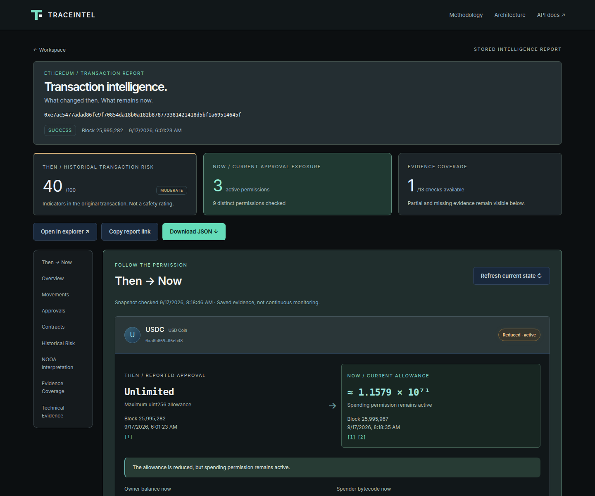
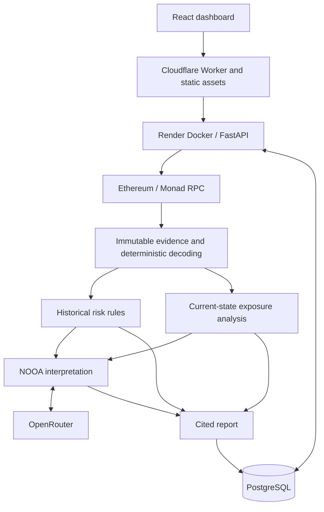

# TraceIntel

**Persistent On-Chain Exposure Intelligence**

[Live app](https://traceintel.eshita.dev) · [Architecture](docs/architecture.md) · [Methodology](docs/methodology.md)

A transaction can finish while the permissions it created remain active. TraceIntel reconstructs Ethereum and Monad transaction evidence and compares historical activity with current on-chain state to determine what remains exposed.



## Why TraceIntel

Transaction explorers explain what happened. TraceIntel follows the permission: **what changed then, what remains now, and does it still matter?** Analysis is read-only and requires no wallet connection.

## Supported networks

Ethereum and Monad mainnet share the same EVM acquisition, decoding and exposure pipeline. Every sample identifies its network; recorded fixtures retain chain provenance.

## What it analyzes

- Transaction and receipt evidence, deterministic EVM decoding and ERC-20 approvals.
- Historical risk signals, kept separate from current allowance, owner balance and spender bytecode.
- THEN → NOW exposure states with block provenance, explicit missing data and evidence-grounded NOOA interpretation.

## Architecture



Blockchain facts, risk signals and exposure states come from deterministic code. NOOA selects and organizes approved, cited claims downstream of that evidence. The LLM does not determine blockchain truth or replace scores. Failed interpretation leaves the evidence available.

## Then → Now

An approval event records historical intent; it does not establish today's allowance. TraceIntel reads allowance, owner balance and spender bytecode at a recorded current block, then compares the permission with its historical state.

`ACTIVE`, `PARTIALLY_ACTIVE`, `REVOKED`, `SUPERSEDED` and `UNKNOWN` describe that comparison. Superseded permissions can still be active; unknown never implies safe. Saved reports remain immutable snapshots. [Exposure semantics](docs/exposure.md) define the exact rules.

## Engineering highlights

Async, bounded RPC acquisition feeds immutable evidence models and versioned deterministic scoring. Structured NOOA outputs are validated against an approved claim catalog. PostgreSQL persistence, Alembic migrations and process-owned job leases support restart recovery; cache revalidation and request/model budgets bound repeated work. Docker, a Cloudflare reverse proxy and automated tests/evaluations cover the deployment boundary.

## Stack

| Layer | Technology |
| --- | --- |
| Backend | Python, FastAPI, Pydantic, SQLAlchemy |
| Interpretation | NOOA, OpenRouter, structured outputs |
| On-chain | Ethereum, Monad, EVM JSON-RPC, ABI/event decoding, ERC-20, proxy inspection |
| Frontend | React, TypeScript, Vite |
| Persistence | PostgreSQL in production; SQLite locally; Alembic |
| Infrastructure | Docker, Render, Cloudflare Workers, GitHub Actions |

## Local development

Requires Python 3.12, uv, Node 22.12+ (22 LTS), npm and Make. Use WSL on Windows.

```sh
cp .env.example .env  # only if .env does not already exist
make install
make backend         # terminal 1: migrate, then localhost:8000
make frontend        # terminal 2: localhost:5173
```

Vite proxies API requests to FastAPI. Deterministic analysis works without an OpenRouter key. To enable interpretation, set `OPENROUTER_API_KEY` and `OPENROUTER_MODEL` in the ignored root `.env`. Provider credentials belong only on the backend, never in `VITE_*` variables. See [.env.example](.env.example) for optional provider settings.

## Testing

```sh
make check
make evaluate
cd frontend
npx playwright install chromium
npm run test:e2e
npx wrangler deploy --dry-run
```

Backend tests cover decoding, immutable evidence, risk/exposure semantics, API protection, storage and job recovery. CI runs the suite against SQLite and PostgreSQL. Frontend tests cover readiness retries, response validation, formatting and the Worker boundary; browser tests cover navigation, both networks, reports and responsive layouts. Offline evaluations check labelled historical and exposure cases. CI also builds the Docker image. [Evaluation methodology](evals/README.md) separates recorded evidence, synthetic cases and opt-in live checks.

## Deployment

[traceintel.eshita.dev](https://traceintel.eshita.dev) runs on Cloudflare → Render Docker → PostgreSQL. The public demo uses Render free compute in Singapore and can take time to wake after inactivity. The UI retries readiness automatically before enabling analysis.

[Deployment operations](docs/deployment.md) documents the actual manual Render configuration, startup migrations and the Worker's required runtime secret.

## Limitations

Current exposure is a block-specific snapshot, not continuous monitoring. Provider data can be incomplete, and arbitrary protocol semantics are not fully modeled. Emitted approval events are not equivalent to current allowance; block-end state is not exact intra-transaction state. Historical risk and current exposure are separate indicators, not safety ratings.
