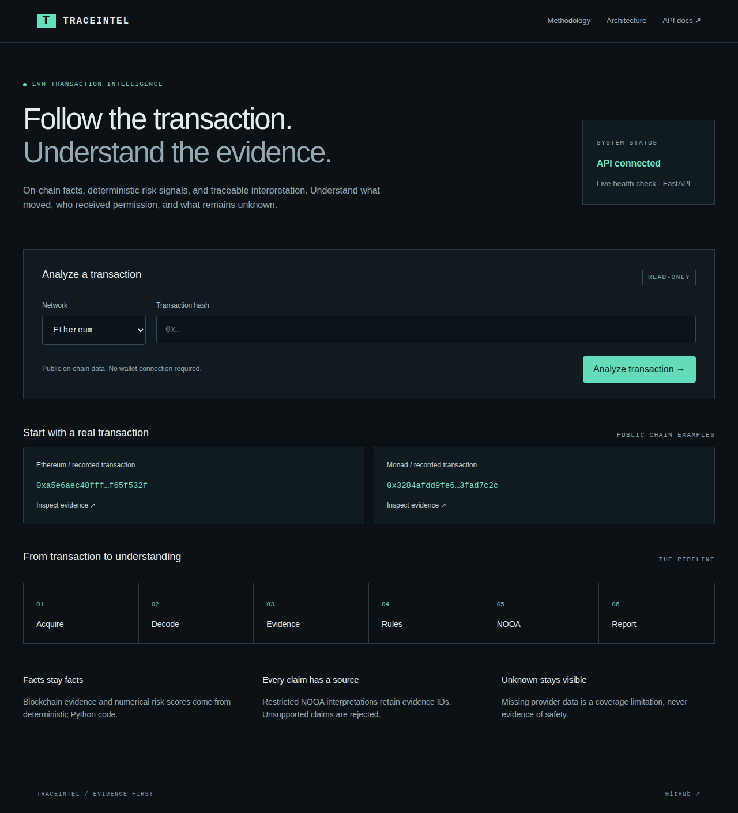
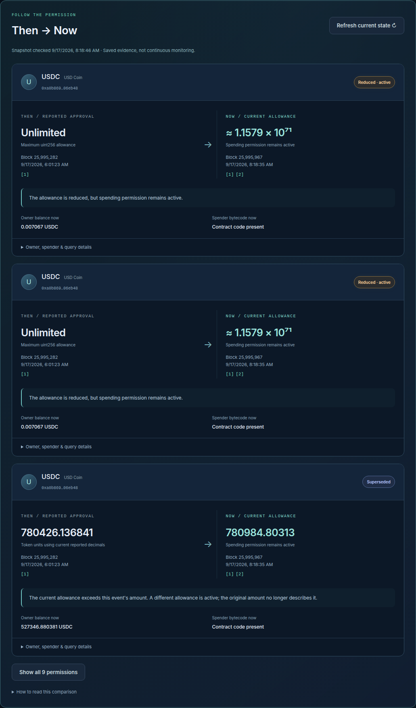
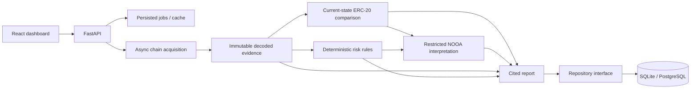

# TraceIntel

**Historical transaction + persistent exposure intelligence.** Give TraceIntel an Ethereum or Monad transaction hash. It acquires on-chain evidence, decodes activity, inspects contracts, computes documented risk indicators, checks which ERC-20 permissions remain active at a recorded current block, and uses restricted NOOA agents to organize a cited report.





## Status

The application runs locally. Real Ethereum and Monad acquisition, the Docker API with PostgreSQL, and live NOOA analysis using `openrouter/auto` have been exercised. The Cloudflare bundle passes a deployment dry run. **Production connection is pending** the Render backend URL and Worker runtime secrets; no live URL is claimed.

## Capabilities

- Ethereum and Monad through a configurable chain registry; asynchronous, bounded, read-only JSON-RPC.
- Transaction/receipt/block consistency checks; exact gas/value integers; standard and explorer-ABI calldata decoding.
- ERC20 transfers/approvals, ERC721 patterns, ERC1155 events, native value and optional call traces.
- Maximum allowances, operator approvals, token metadata, historical bytecode and EIP-1967 implementation/beacon slots.
- Explorer verification represented as verified, unverified or unavailable; missing data remains explicit.
- ERC-20 Then → Now comparison: allowance, owner balance, spender bytecode, deterministic exposure status and block/time provenance.
- Separate historical-risk, current-exposure and coverage cards; refreshable immutable snapshots.
- Versioned deterministic scoring with evidence IDs and duplicate suppression.
- NOOA transaction analysis, relevant contract analysis and synthesis using PredictStrategy. Claims must match an approved evidence catalog.
- Persisted jobs and real stage progress, shareable reports, JSON downloads, five-minute snapshot cache buckets and block revalidation.
- SQLite/PostgreSQL repository adapters, Alembic migrations, persisted rate/budget counters and lease-based interrupted-job recovery.
- Responsive React dashboard, real sample transactions, methodology/architecture pages and FastAPI OpenAPI docs.

## Run locally

Requires Python 3.12, [uv](https://docs.astral.sh/uv/), Node **22 LTS** (22.12+), npm and Make. On Windows, run development commands inside WSL.

```sh
nvm install && nvm use       # if using nvm
cp .env.example .env        # only if .env does not already exist
make install
make backend               # terminal 1: migrations, then API on localhost:8000
make frontend              # terminal 2: dashboard on localhost:5173
```

Open [the dashboard](http://localhost:5173) or [API documentation](http://localhost:8000/docs). Vite proxies API requests to FastAPI. The connectivity badge checks the real API.

To enable NOOA, put `OPENROUTER_API_KEY` and `OPENROUTER_MODEL=openrouter/auto` in the ignored root `.env`. `TRACEINTEL_OPENROUTER_*` aliases are also supported; use one naming style. No key is required for deterministic analysis: reports explicitly say interpretation is unavailable.

An Etherscan v2 key enables supported explorer lookups. Set `TRACEINTEL_TRACES_ENABLED=true` only with a provider supporting callTracer. Archive state availability depends on the RPC provider.

Never place secrets in frontend `VITE_*` variables. Neither keys nor authenticated RPC URLs are returned in reports.

## Verify

```sh
make check                 # backend/frontend lint, types, tests and production build
make evaluate              # twelve offline evaluation cases, including real approval evidence
cd frontend
npx playwright install chromium
npm run test:e2e            # browser checks without live analysis/model calls
npx wrangler deploy --dry-run
```

Opt-in checks use real providers and can incur model charges:

```sh
PYTHONPATH=backend uv run python scripts/verify_exposure_live.py  # RPC only
PYTHONPATH=backend uv run python scripts/verify_nooa_live.py
cd frontend
TRACEINTEL_LIVE_E2E=1 TRACEINTEL_EXPECT_LIVE_AGENT=1 npm run test:e2e -- --grep approval
```

CI runs backend tests against SQLite and PostgreSQL, deterministic evaluations, frontend lint/types/tests/build, browser checks, Cloudflare bundling and a Docker build. These workflows run on push/PR; local verification does not imply a GitHub-hosted run has occurred.

## Architecture



Blockchain facts and numerical scores are never generated by an LLM. Frozen models and serialized nested evidence preserve immutability. NOOA selects and orders approved claims and verification steps; altered claims or citations are rejected. Original evidence remains visible regardless of interpretation success.

The API currently runs **one process**, with bounded concurrent jobs. Process-owned database leases protect jobs during deployment overlap; expired or stopped workers become retryable. One configured worker/instance is supported; queue concurrency remains per-process.

## Repository

```text
backend/app/
  api/          routes, request protection, dependencies
  blockchain/   RPC, decoding, metadata, contracts, proxies, traces
  risk/         documented deterministic rules and scoring
  agents/       NOOA roles, claim catalog and validation
  models/       frozen Pydantic contracts
  services/     pipeline and repository protocol
  storage/      SQLAlchemy adapters and tables
  evaluation/   offline evaluation runner
backend/migrations/  Alembic schema history
backend/tests/       deterministic, API, agent and storage tests
frontend/src/        React pages, components, hooks, typed API
frontend/worker/     Cloudflare asset/API proxy
evals/cases/         recorded and synthetic evidence
docs/               methodology, architecture, API and operations
```

## Deployment and limitations

Target: Cloudflare frontend/API proxy → Render Docker FastAPI → PostgreSQL. See [deployment](docs/deployment.md), [architecture](docs/architecture.md), [API](docs/api.md), [methodology](docs/methodology.md), [NOOA](docs/nooa.md) and [evaluation](evals/README.md).

Historical risk and current exposure are separate; neither is an overall safety rating. Current state is a recorded snapshot, not continuous monitoring. See [exposure methodology](docs/exposure.md) for precise status semantics. Event patterns can be spoofed; emitted approval is not current allowance. Block-end state is not exact intra-transaction state. Explorer metadata is current. Custom proxies, arbitrary protocol semantics, full state-diff accounting and token pricing are not covered. Raw evidence is retained when decoding is unavailable. Missing traces mean internal movements are unknown.

Screenshots are captured from the running application. [Redesigned report](docs/screenshots/exposure-dashboard.png), [Then → Now](docs/screenshots/exposure-comparison.png), [mobile exposure](docs/screenshots/exposure-mobile.png). [Approval report](docs/screenshots/approval-report.png) and [mobile report](docs/screenshots/report-mobile.png).
